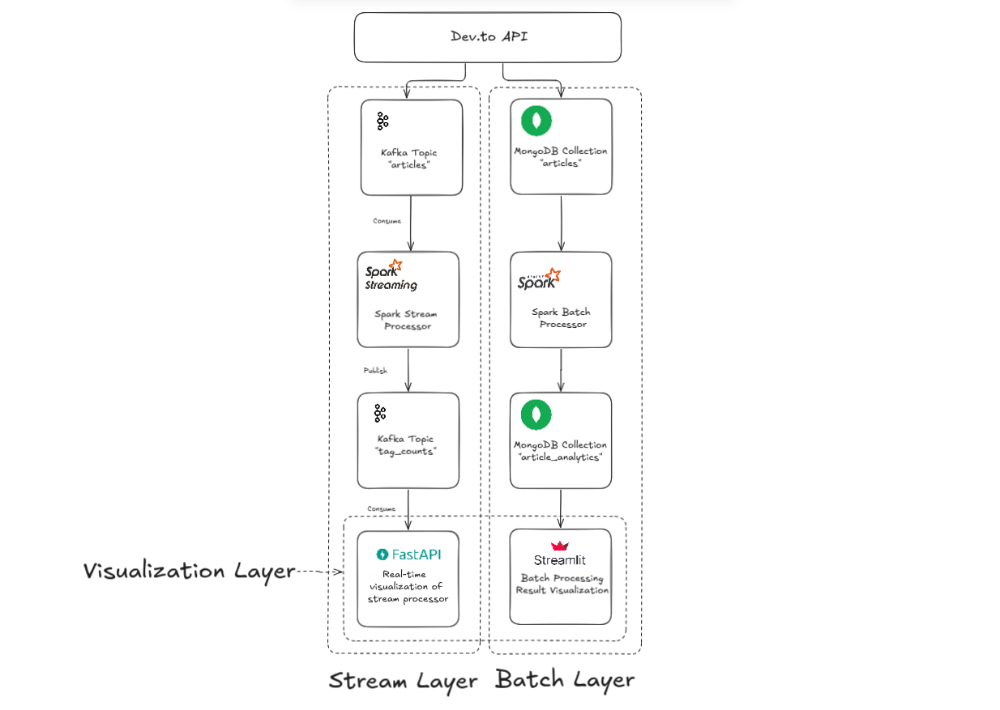
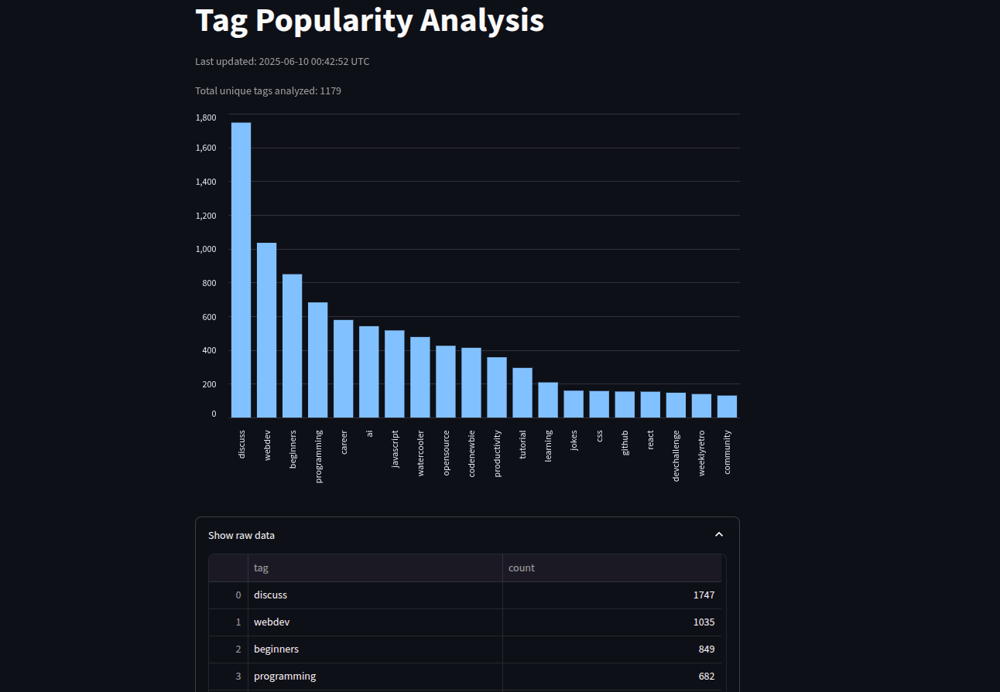
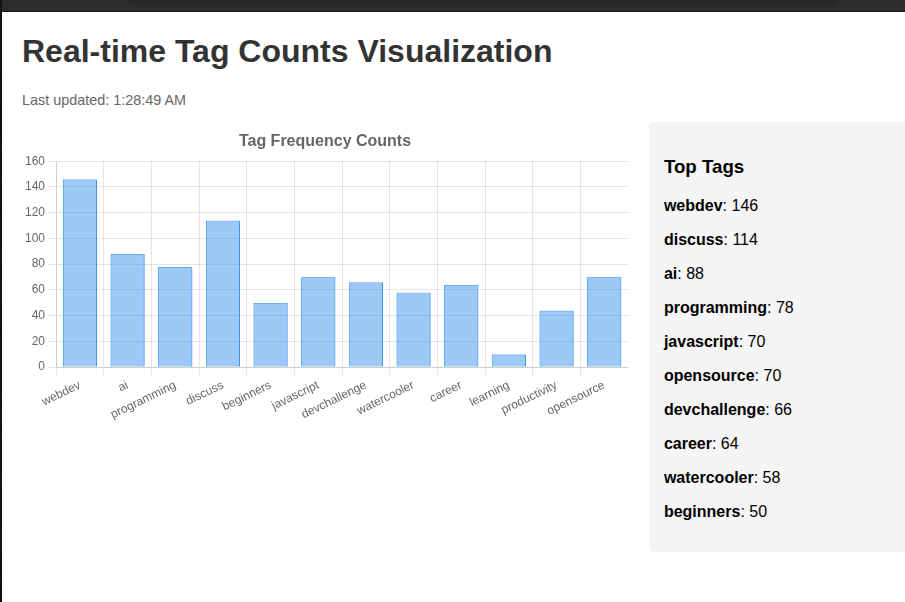

# DevArticles-BigData

DevArticles-BigData is a big data processing system built to analyze technical articles published on [DEV.to](https://dev.to/), using both real-time and batch processing pipelines. This project was developed as part of the Big Data course at the **National Institute of Applied Sciences and Technology (INSAT)**, under the supervision of **Ms. Lilia Sfaxi**.

---

## Objectives

- Fetch and ingest articles from the DEV.to public API.
- Apply **real-time processing** to identify trending tags as articles are published.
- Perform **batch analytics** to capture historical tag usage patterns.
- Store both raw and processed data in a flexible and queryable data store.
- Provide interactive dashboards for data exploration and visualization.

---

## Technologies Used

- **Python** – For data ingestion, batch jobs, and dashboards.
- **Java** – For Spark Structured Streaming due to better support and stability.
- **Apache Kafka** – For real-time article ingestion and stream communication.
- **Apache Spark** – For both streaming and batch data processing.
- **MongoDB** – NoSQL database for storing article metadata and analytics.
- **FastAPI** – To expose REST APIs and serve real-time data.
- **Streamlit** – For visualizing batch results through an interactive dashboard.
- **Docker & Docker Compose** – For containerized, reproducible deployment.

---

## Pipeline Architecture

The system is designed around three key components: ingestion, processing, and visualization.

### Ingestion

- Articles are fetched regularly from the DEV.to API using `fetch_articles.py`.
- Fetched articles are pushed to the `articles` topic in **Kafka**.

### Real-Time Processing

- A **Java-based Spark Structured Streaming** job consumes new articles from Kafka.
- It extracts and counts tags from each article.
- Results are sent to the `tag_counts` topic and also stored in MongoDB.
- **FastAPI** exposes real-time tag trends via a REST API.

### Batch Processing

- A Python-based **Spark batch job** (`analyse_articles.py`) is run periodically.
- It fetches a larger set of articles and computes global tag statistics.
- Aggregated results are stored in MongoDB under `article_analytics`.
- **Streamlit** is used to visualize these trends interactively.

---

### Pipeline Architecture Diagram

---

## Example Dashboards

### Batch Analytics (Streamlit)

Aggregated tag frequency across a historical window.

---

### Real-Time Tag Tracking (FastAPI)

Live updates of trending tags based on the latest articles.

---
